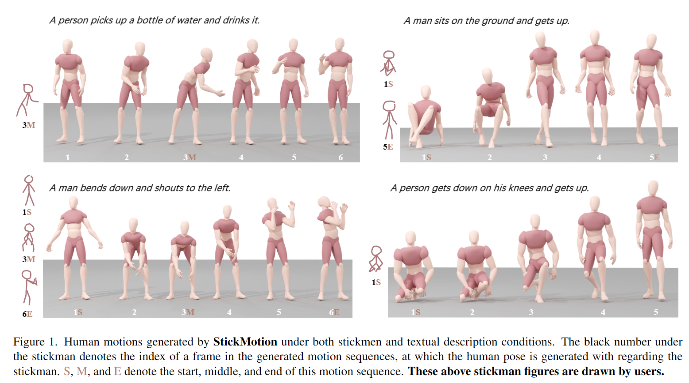
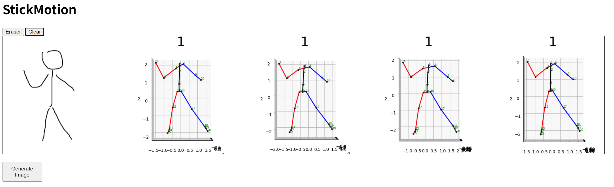

 # StickMotion: Generating 3D Human Motions by Drawing a Stickman
 >This repository is based on [ReModiffuse](https://github.com/mingyuan-zhang/ReMoDiffuse). Thanks for their great work!

## Abstract
Text-to-motion generation, which translates textual descriptions into human motions, has been challenging in accurately capturing detailed user-imagined motions from simple text inputs. This paper introduces **StickMotion**, an efficient diffusion-based network designed for multi-condition scenarios, which generates desired motions based on traditional text and our proposed stickman conditions for global and local control of these motions, respectively. We address the challenges introduced by the user-friendly stickman from three perspectives:  1) **Data generation.** We develop an algorithm to generate hand-drawn stickmen automatically across different dataset formats. 2) **Multi-condition fusion.** We propose a multi-condition module that integrates into the diffusion process and obtains outputs of all possible condition combinations, reducing computational complexity and enhancing StickMotion's performance compared to conventional approaches with the self-attention module. 3) **Dynamic supervision.** We empower StickMotion to make minor adjustments to the stickman's position within the output sequences, generating more natural movements through our proposed dynamic supervision strategy. Through quantitative experiments and user studies, sketching stickmen saves users about 51.5% of their time generating motions consistent with their imagination. Our codes, demos, and relevant data will be released to facilitate further research and validation within the scientific community.




## Note
The structure of stickman encoder has been updated, so we retrained the KIT-ML dataset. The largest dataset, HumanML3D, is still in the training process.

### Done
- You can draw a stickman and generate the corresponding pose by running stickman/interaction/main.py.

- The training and evaluation code on KIT-ML dataset.

### TODO
- The training and evaluation code on HumanML3D dataset.
- A complete interactive demo.


## Environment Setup

There are two ways to set up the environment:
### Python Install
```
pip install -r requirements.txt
```
<!-- Refer to [ReModiffuse](https://github.com/mingyuan-zhang/ReMoDiffuse?tab=readme-ov-file#installation:~:text=2208.15001%7D%2C%0A%20%20year%3D%7B2022%7D%0A%7D-,Installation,-%23%20Create%20Conda).
### Conda Env (Maybe Time-saving)
- Make sure nvidia driver and conda are installed.
- Download the prepared conda environment [tar](google drive out of memeroy).
- Install the  components required for MMCV.
    ```
    apt-get update
    apt-get install -y libgl1-mesa-glx libglib2.0-0
    ```
- Use. 
    ```
    tar xvf /path/to/mogen_env.tar
    conda activate /path/to/mogen
    python -m pip show torch # 2.3.1
    python -c "import torch; print(torch.cuda.is_available())" # should be True
    ```
- (Test with NVIDIA-SMI 550.54.14 and docker image pytorch/pytorch:2.2.1-cuda12.1-cudnn8-devel. If you encounter any problems, please refer to the **Python Install** for environment configuration.) -->


### Prepare Data
**Dataset data,** refer to [ReModiffuse](https://github.com/mingyuan-zhang/ReMoDiffuse#:~:text=r%20requirements.txt-,Data%20Preparation,-Download%20data%20files).

> The dataset data is not necessary if you want to try only the web demo shown above.

**Weight data,** refer to Google Drive as shown below.

The directory sructure of the repository should look like this:

```
StickMotion
├── mogen
├── tools
├── configs
├── stickman
│   ├── weight [1]
│   └── interaction
├── logs [2]
│   ├── human_ml3d
│   └── kit_ml
└── data [3]
    ├── database
    ├── datasets
    ├── evaluators
    └── glove

[1] https://drive.google.com/drive/folders/1yykLJbIPlt818T-2MM54D_KgrwKOhtCs?usp=sharing
[2] https://drive.google.com/drive/folders/1RVCuPZPjV-8bd8n42slwZYMpiwpi5Bug?usp=sharing
[3] https://github.com/mingyuan-zhang/ReMoDiffuse
```

## Getting Started
Let's take the KIT-ML dataset as an example.

###  Training the Stickman Encoder (optional, the pretrained weight is provided)
```
python stickman/runner.py configs/remodiffuse/remodiffuse_kit.py VERSION_NAME

# the logs and weights will be saved in stickman/logs/kit_ml/VERSION_NAME
# then pick up the stickman encoder weights from the logs after training

python stickman/split_weight.py --weight_path stickman/logs/kit_ml/VERSION_NAME/last.ckpt --save_path stickman/weight/kit_ml

# If you want to use it in the training of StickMotion, specify the weight path to configs/remodiffuse/remodiffuse_kit.py line 132
```


### Stickman-to-Pose Visualization

```
python stickman/interaction/main.py
```

### Evaluation

```
python tools/lg_test.py logs/kit_ml/last.ckpt 0
# arg1: path to the checkpoint
# arg2: gpu id
```


### Training

```
python tools/lg_train.py configs/remodiffuse/remodiffuse_kit.py  VERSION_NAME 0
# arg1: path to the config file
# arg2: VERSION_NAME, which will be used to save the model, logs, and codes
# arg3: gpu id
```

### More Details
- Stickman Generation Algorithm (SGA): stickman/utils.py Class Stickman 
- SGA in StickMotion training: mogen/datasets/stickman_motion_dataset.py
- Multi-Condition Module: /mnt/new_disk2/wangtao/StickMotion/mogen/models/attentions/semantics_modulated.py
- Dynamic Supervision: mogen/models/architectures/diffusion_architecture.py line 128

